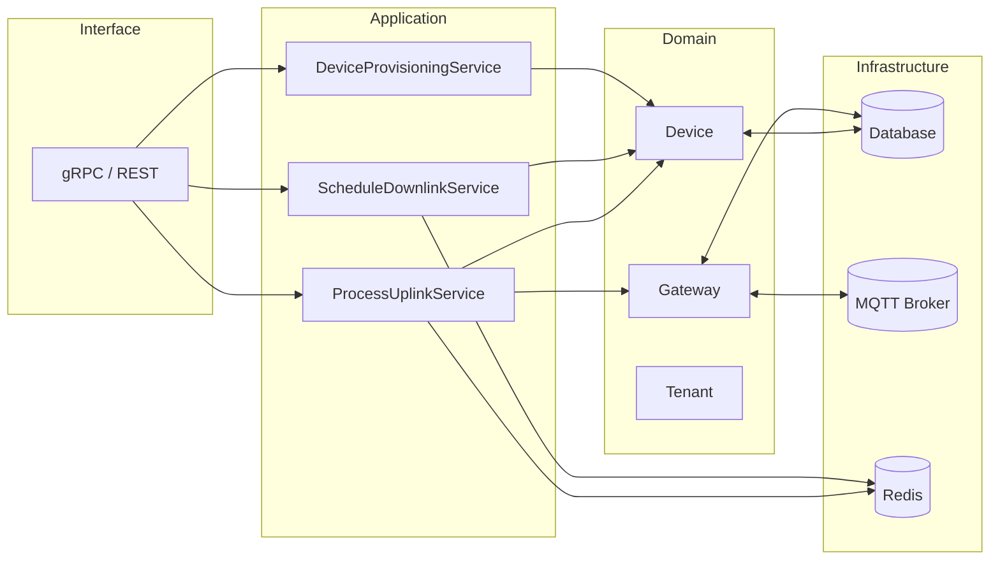

# Technical Design for Task 1: Establish Architecture

## Overview
This document presents a detailed architecture proposal for building a new LoRaWAN network server from the ground up. The goal is a clean separation of concerns so that core domain logic remains independent from infrastructure and external interfaces. The design follows **Domain-Driven Design (DDD)** and **SOLID** principles.

## Bounded Contexts
We organize the system into distinct bounded contexts to prevent cross-domain coupling:

- **Gateway Management**: registration, status tracking and connection handling for gateways.
- **Device Management**: provisioning, activation state, device sessions and queue management.
- **Tenant & User Management**: multi-tenant isolation and user permissions.
- **Network Operations**: uplink processing, downlink scheduling, MAC command handling.
- **Integrations**: forwarding events to external systems and consuming external APIs.

Each context exposes clear interfaces and owns its persistent data. Events are published across contexts when needed (e.g. device created, downlink scheduled).

## Domain Layer
Entities and value objects encapsulate invariants within each bounded context:

- `Gateway` entity with value objects `GatewayId`, `Location`, `FrequencyPlan`.
- `Device` aggregate root containing `DeviceSession`, `SecurityKeys` and `FCntState` value objects.
- `Tenant` aggregate with associated `User` entities and role assignments.
- `DownlinkMessage` value object including payload, port and transmission constraints.

Domain logic stays free from frameworks or database code. Each aggregate exposes methods enforcing invariants (e.g. `Device.activate()`, `Gateway.updateLocation()`).

## Application Layer
Application services orchestrate domain objects and implement use cases. Examples:

- `ProcessUplinkService` receives uplink frames, performs deduplication and invokes domain methods to create events.
- `ScheduleDownlinkService` retrieves queued downlinks and interacts with the gateway interface.
- `DeviceProvisioningService` manages device life‑cycle by coordinating storage and join server lookups.

Services depend on abstractions for persistence and external APIs. They emit domain events that can be handled asynchronously by other components.

## Infrastructure Layer
Infrastructure implements the abstractions defined in the application and domain layers:

- Repository implementations using SQL (e.g. PostgreSQL) or key-value stores.
- Gateway backends for MQTT or other transport protocols.
- Redis-based queues for uplink sets and downlink scheduling.
- gRPC servers and clients for public APIs and inter-context communication.

Infrastructure components are replaceable thanks to dependency inversion.

## Interface Layer
The interface layer exposes APIs and transports for users and external systems:

- **gRPC / REST** endpoints for management and data exchange.
- Web sockets or message queues for near real-time notifications.
- Command line tools for operational tasks.

The interface layer translates incoming requests into application service calls and returns DTOs, keeping protocol and serialization concerns outside the core logic.

## Dependency Inversion Strategy
All domain and application components depend on interfaces rather than concrete implementations. Example patterns:

- `DeviceRepository` trait defines persistence methods; infrastructure provides a SQL implementation.
- `GatewayClient` trait represents gateway communication; MQTT or other backends implement it.
- Factories or dependency injection configure the concrete types at runtime.

This approach enables unit testing with mocks and swapping infrastructure pieces without touching domain code.

## Project Structure
```
/Domain
    /Gateway
    /Device
    /Tenant
/Application
    /Services
    /Events
/Infrastructure
    /Persistence
    /Messaging
/Interface
    /Grpc
    /Rest
```
Modules under each folder map one-to-one with bounded contexts. Cross-cutting utilities (logging, metrics, configuration) live in a shared library.

## Extensibility Guidelines
1. New contexts should start with domain entities and value objects first.
2. Define repositories and service interfaces inside the context.
3. Add infrastructure implementations without leaking external libraries into domain modules.
4. Use explicit events to communicate between contexts instead of direct calls.
5. Maintain small, cohesive modules to uphold the Single Responsibility Principle.

## Diagram

This diagram shows the layered architecture and how components interact while remaining loosely coupled.

## Summary
The proposed architecture enforces strict boundaries so that business rules remain technology agnostic. By modeling the LoRaWAN network server around bounded contexts, using rich domain objects and depending on abstractions, the system can evolve over time without accruing tight coupling. Infrastructure implementations can change (different databases, message brokers) while the domain model stays stable.

