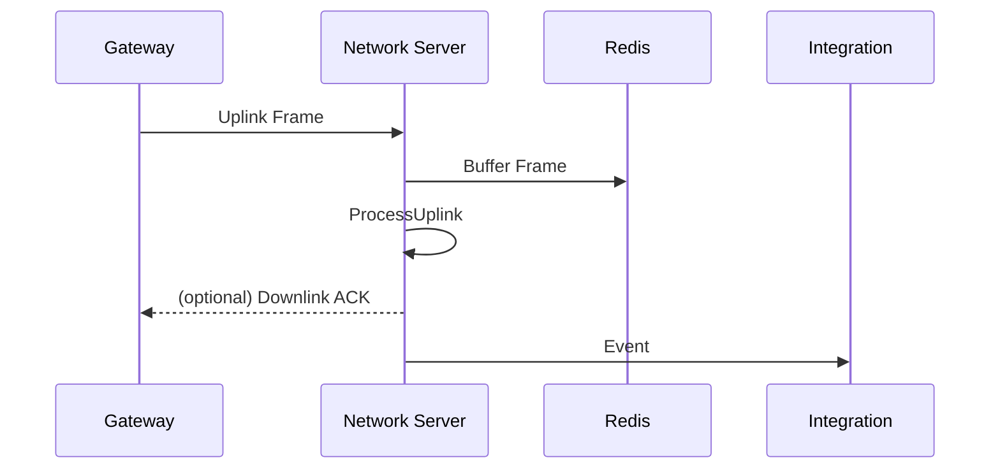

# Technical Design for Task 2: Implement Functional Modules

## Introduction
This design builds upon the architectural foundation from Task 1. We outline how to incrementally implement the network server features until it matches the existing ChirpStack functionality. The design emphasises modularity, testability and the ability to scale components horizontally.

## Phase 1 – Core Services
### 1. Gateway Communication
- **Protocol Abstraction**: Define a `GatewayClient` trait with methods for sending and receiving gateway messages. Provide an MQTT implementation first and keep the door open for others like HTTP or proprietary transports.
- **Connection Management**: Maintain a registry of active gateway sessions. Use heartbeats to track availability and close idle sessions.
- **Uplink Buffering and Deduplication**: Store incoming frames in a temporary Redis structure keyed by `uplink_id`. A short TTL lock ensures only one worker processes the deduplicated set.

### 2. Device Management
- **CRUD Operations**: Expose application services for creating, retrieving, updating and deleting devices. Validate tenant quotas and unique DevEUIs.
- **Session Storage**: Persist `DeviceSession` records in Redis for fast access during frame handling. Synchronize with a SQL database for long‑term storage.
- **Join Server Integration**: Implement a pluggable trait `JoinServerClient` allowing multiple backends (HTTP, gRPC). The device activation service uses this trait to obtain root keys.

### 3. Downlink Scheduling
- **Queue Design**: The `DeviceQueue` repository manages ordered downlink items per device. Items include payload, port, confirmed flag and scheduling constraints.
- **Scheduler**: A periodic task checks for due downlinks and uses the gateway interface to enqueue them. If an ACK is pending, the scheduler merges it with the next application downlink or creates an empty frame.
- **Reliability**: Track `FCntDown` counters in the session and retry transmissions until the gateway acknowledges.

## Phase 2 – Extensions
### 4. Integrations
- **Event Bus**: Publish device events (uplinks, joins, acknowledgements) to an internal bus. Integration modules subscribe and forward to external systems.
- **Adapters**: Provide adapters for databases, message brokers and cloud services. Each adapter implements a common trait so new targets can be added easily.

### 5. gRPC / API Layer
- **Service Definitions**: Use protobuf to define management APIs (gateways, devices, tenants) and data APIs (queueing downlinks, retrieving events).
- **Separation of Concerns**: Generated server stubs delegate to application services. DTOs map to domain models through dedicated converters.

### 6. Monitoring and Metrics
- **Metrics Collection**: Expose Prometheus counters and histograms for uplink volume, downlink latency and queue length.
- **Structured Logging**: Emit contextual logs (tenant, dev_eui, gateway_id) for each processing step to aid debugging.
- **Health Checks**: Provide endpoints to verify database, Redis and message broker connectivity.

### 7. Additional Features
- **Multicast & FUOTA**: Implement additional aggregates and services for multicast groups and firmware updates. Use the same repository pattern so different storage engines can back these features.
- **Roaming Interfaces**: Follow LoRaWAN Backend Interfaces specifications to exchange traffic with other network servers.
- **Pluggable Storage**: Abstract persistence to support SQL engines (PostgreSQL, MySQL) or key-value stores. Migrations ensure schema consistency.

## Deployment Considerations
- Use containerization (e.g. Docker) and orchestration tools to scale gateway and API workers independently.
- Provide configuration through environment variables or a central configuration service.
- Automate migrations and seed data with bootstrap jobs.

## Example Runtime Flow
1. A gateway publishes an uplink frame to the MQTT broker.
2. The Gateway worker receives the message, buffers it for deduplication and emits an `UplinkReceived` event.
3. The Uplink service loads the device session and processes MAC commands, generating any necessary downlink response.
4. Downlink Scheduler picks up queued messages and sends them to the gateway via the `GatewayClient` interface.
5. Integration subscribers forward the uplink event to external databases or cloud services.

This sequence shows the collaboration between core modules in the simplest case.

## Conclusion
The phased approach ensures the most critical services work first while leaving room for future expansion. By adhering to the abstractions laid out in Task&nbsp;1, we keep the implementation flexible and maintainable. Each module can be developed and tested in isolation, then deployed together to form a full-featured LoRaWAN Network Server.

