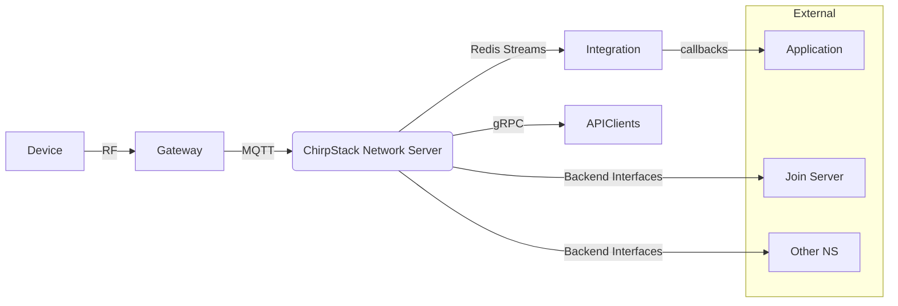
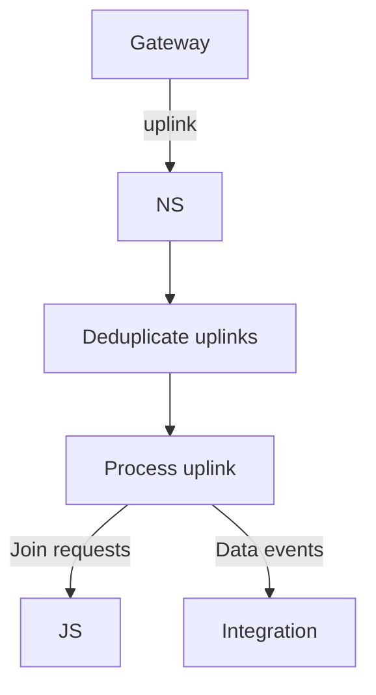
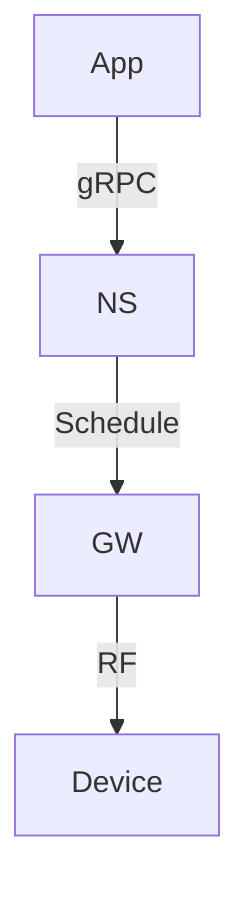

# Technical Design Overview

ChirpStack NMS (Network Management Server) is a LoRaWAN® Network Server
implementation written in Rust. The workspace contains multiple crates that
implement different layers of the system:

- **chirpstack**: main network server logic including gateway handling,
  uplink/downlink processing, database access and gRPC API setup.
- **backend**: client for the LoRaWAN Backend Interfaces used to communicate
  with Join Servers and roaming Network Servers.
- **chirpstack-integration**: reads events from Redis Streams and dispatches
  them to an integration implementation.
- **lrwn / lrwn-filters**: libraries for LoRaWAN protocol definitions and
  filtering helpers.
- **api**: protobuf definitions and generated gRPC code for external APIs.

## High level architecture

## Uplink processing
The MQTT gateway backend collects uplink frames and performs deduplication before
handling them. A simplified flow is shown below.

## Downlink processing
External applications enqueue downlinks through the gRPC API. The network server
schedules the frame and forwards it to the gateway.

The server also exposes metrics through Prometheus and logs using the tracing
crate. Redis and a SQL database (PostgreSQL or SQLite) are used for runtime
state and persistent storage respectively.
